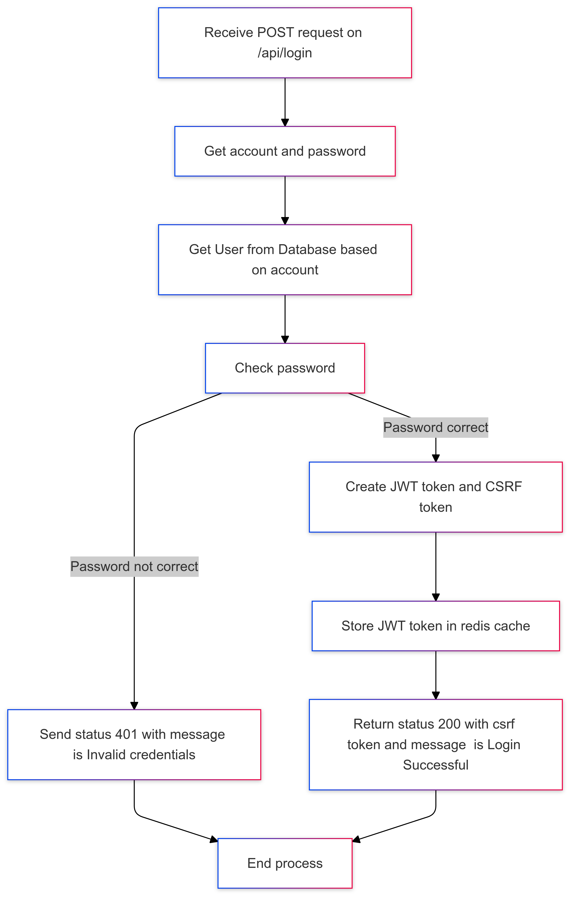

# Scoreboard Project : Feature Login

## Introduce

User have to login before use any resource from BE.

## Technical information

- API Endpoint : `/api/login`
- Method: `POST`
- Body:
  - `account` : string
  - `password` : string

## Workflow

- 1 - Receive POST request on `/api/login`
- 2 - Get `account` and `password` (Hash Password)
- 3 - Get User from Database base on `account` to get `password` and use it to compare with password from `step 2`.
- 4 - Check password:
  - 4.1 - If password not correct, send status `401` with message `"Invalid credentials"`, then move on step 8;
  - 4.2 - If password correct, then move on step 5.
- 5 - Create JWT token (key: **jToken**) base on `account` and `password` at step 2 and random CSRF token (key : **csrfToken**), then set all of them in cookie with configuration is:
  - `httpOnly` : true
  - `samesite` : true
  - `expire` : 3 hour
- 6 - Store JWT token in redis cache with `key` named by `account` and `value` is JWT token and it will expire in 3 hour.
- 7 - return status `200` with message `"Login Successfull"` and content is `csrf token` which created at step 5
- 8 - End process

## Diagram

Here is activy diagram for this feature.


Code mermaid:

```
graph TD
    A[Receive POST request on /api/login] --> B[Get account and password]
    B --> C[Get User from Database based on account]
    C --> D[Check password]
    D -->|Password not correct| E[Send status 401 with message is Invalid credentials]
    D -->|Password correct| F[Create JWT token and CSRF token]
    F --> G[Store JWT token in redis cache]
    G --> H[Return status 200 with csrf token and message  is Login Successful]
    E --> I[End process]
    H --> I
```

## Time and plain

- Complexity: Easy
- Estimated time:
  - Coding : 0.2 MM
  - Deploy + Self Test : 0.2 MM
  - Testing : 0.1 MM
