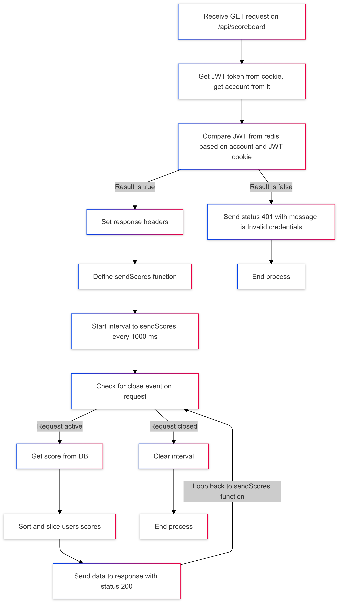

# Scoreboard Project : Feature get top 10 scores

## Introduce

Feature allows sending data of top 10 users with the highest score in every second.

Requirements:

- Use MySQL to store data of user's score
- Use SSE (HTML5 Server-Sent Events) to keep connection alive, use for sync data from server to client.

## Technical information

- API Endpoint : `/api/scoreboard`
- Method: `GET`
- Apply SSE (HTML5 Server-Sent Events) solution to transmit information to users with the following settings:
  - `Content-Type`: text/event-stream
  - `Cache-Control`: no-cache
  - `Connection`: keep-alive
- Send top 10 users scores to client in every second.
- Cookies :
  - token (JWT token)

## Workflow

- 1 - Receive GET request on `/api/scoreboard`
- 2 - Get JWT token from cookie, get `account` from it and Compare JWT from redis base on `account` and JWT cookie.
  - 2.1 - If result is `false` : send status `401` with message `"Invalid credentials"` and move on step 8
  - 2.2 - If result is `true` : then move on step 3.
- 3 - Set response headers base on this configuration:
  - `Content-Type`: text/event-stream
  - `Cache-Control`: no-cache
  - `Connection`: keep-alive
- 4 - Define `sendScores` function
- 5 - Start interval to `sendScores` every 1000 ms
- 6 - Check for close event on request
  - 6.1 - When Request active
    - 6.1.1 - Get score from DB
    - 6.1.2 - Sort and slice users scores
    - 6.1.3 - Send data to response with status is `200`
    - 6.1.4 - Back to step 4
  - 6.2 - When Request closed, move on step 6
- 7 - Clear interval
- 8 - End process

## Diagram

Here is activy diagram for this feature.

Code Mermaid

```
graph TD
    A[Receive GET request on /api/scoreboard] --> B[Get JWT token from cookie, get account from it]
    B --> C[Compare JWT from redis based on account and JWT cookie]
    C -->|Result is false| D[Send status 401 with message is Invalid credentials]
    C -->|Result is true| E[Set response headers]
    E --> F[Define sendScores function]
    F --> G[Start interval to sendScores every 1000 ms]
    G --> H[Check for close event on request]

    H -->|Request active| I[Get score from DB]
    I --> J[Sort and slice users scores]
    J --> K[Send data to response with status 200]
    K --> |Loop back to sendScores function| H

    H -->|Request closed| L[Clear interval]
    L --> M[End process]

    D --> N[End process]

```

## Time and plain

- Complexity: Easy
- Estimated time:
  - Coding : 0.1 MM
  - Deploy + Self Test : 0.1 MM
  - Testing : 0.1 MM
