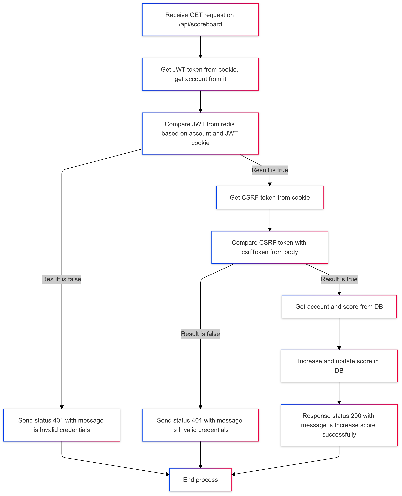

# Scoreboard Project : Feature increase score

## Introduce

With this feature, users now have the ability to increase their scores.

Requirements:

- Check authentication before increasing the user's score.
- Check and save the new score in the database.

## Technical information

- API Endpoint : /api/up
- Method : "PUT"
- Body :
  - csrfToken : string
- Cookies :
  - token (JWT token)

## Workflow

- 1 - Receive GET request on `/api/scoreboard`
- 2 - Get JWT token (key: **jToken**) from cookie, get `account` from it and Compare JWT from redis base on `account` and JWT cookie.
  - 2.1 - If result is `false` : send status `401` with message `"Invalid credentials"` and move on step 8
  - 2.2 - If result is `true` : then move on step 3.
- 3 - Get CSRF token (key : **csrfToken**) from cookie, then compare this token with `csrfToken` from body.
  - 3.1 - If result is `false` : send status `401` with message `"Invalid credentials"` and move on step 8
  - 3.2 - If result is `true` : then move on step 4.
- 3 - Get `account` and `score` from DB, then increase and update this `score` in DB.
- 4 - Response status `200` with message `"Increase score successfully"`
- 5 - End process

## Diagram

Here is activy diagram for this feature.



Mermaid code

```
graph TD
    A[Receive GET request on /api/scoreboard] --> B[Get JWT token from cookie, get account from it]
    B --> C[Compare JWT from redis based on account and JWT cookie]
    C -->|Result is false| D[Send status 401 with message is Invalid credentials]
    C -->|Result is true| E[Get CSRF token from cookie]

    E --> F[Compare CSRF token with csrfToken from body]
    F -->|Result is false| G[Send status 401 with message is Invalid credentials]
    F -->|Result is true| H[Get account and score from DB]

    H --> I[Increase and update score in DB]
    I --> J[Response status 200 with message is Increase score successfully]

    D --> K[End process]
    G --> K
    J --> K
```

## Time and plain

- Complexity: Easy
- Estimated time:
  - Coding : 0.1 MM
  - Deploy + Self Test : 0.1 MM
  - Testing : 0.1 MM
